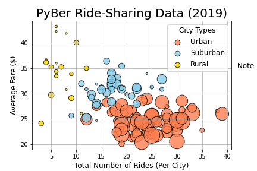
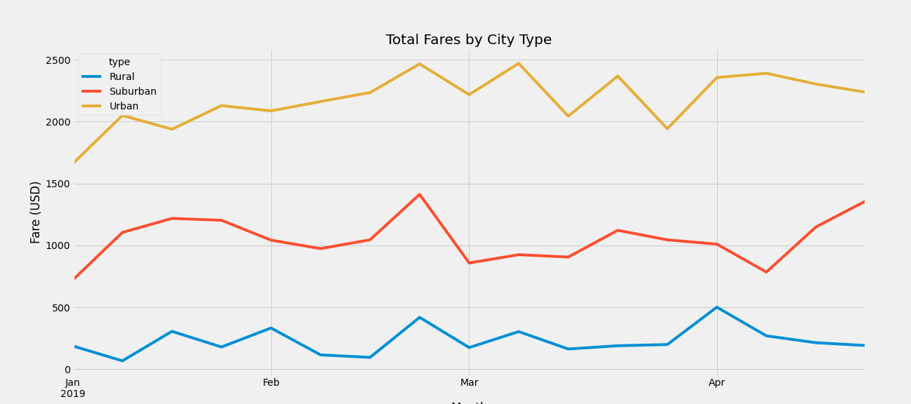
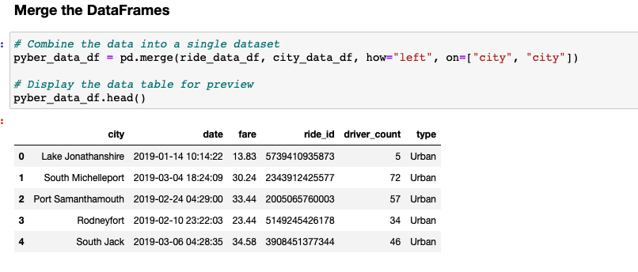
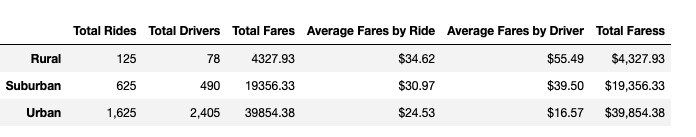
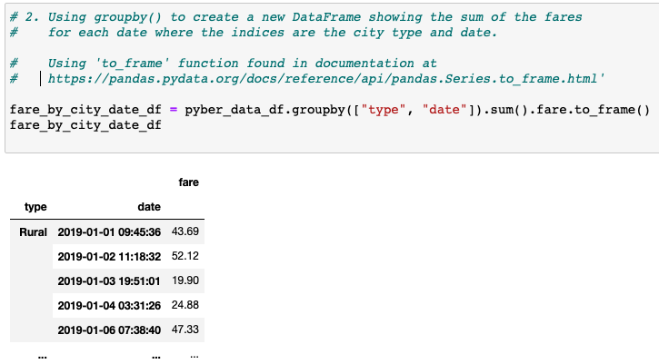
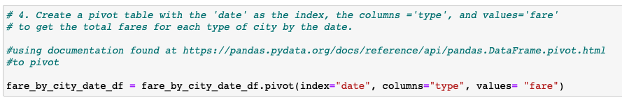
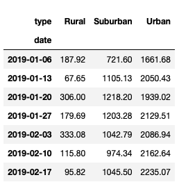
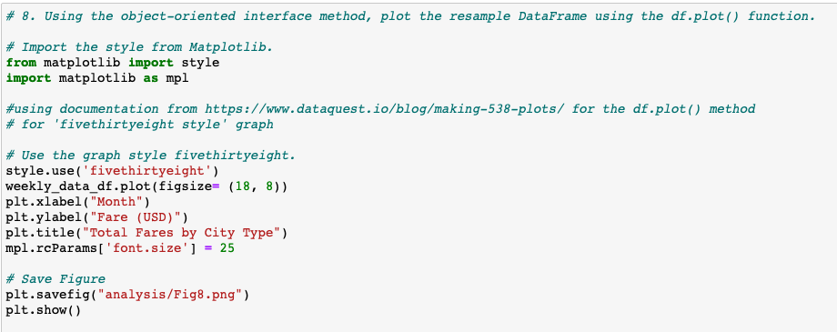

# Overview

This project uses pandas to analyze data sets from a ride-sharing platform (PyBer) and Matplotlib to visualize fare and rider data trends across rural, suburban, and urban areas summarized in the following graphs:

# Results

Two data sets with rider and city-specific information were initially provided from PyBer. These data sets were merged using pandas `pd.merge` operator to calculate ride, driver, and fare totals by city type, as well as per driver and ride fare averages.  

Using the `.groupby()` function, these totals were added as indices to the following summary data frame:

To isolate the data needed to plot fare trend data over time, the `to_frame()` operator, the “type” and “date” are used to create a new multi-index data frame where the indices are the city type and date:

Next, a pivot table using the `.pivot()` function is created using the previous data frame so that the total fares for each day can be visualized using the city types and columns and dates as rows.  

Last, the 'FiveThirtyEight' style was imported from Matplotlib to visualize the data as a line graph.

# Summary

Following are three recommendations that come from the previous analysis:

- Adopting ‘surge pricing’ may help better monetize the highest-demand urban areas and boost average fares.   Data from suburban areas indicate that, within limits, riders may accept slightly higher average prices 

- There are similar spikes and dips in total fares across city types, pointing to more similarities between city types than one might expect.  Given the similarity in trend lines, it should be fairly simple to anticipate changes in supply and demand and respond by deploying measures that boost the supply of riders or demand from riders.  

- The biggest area of opportunity appears to be in leveraging the suburban areas to increase demand at the margin.  
